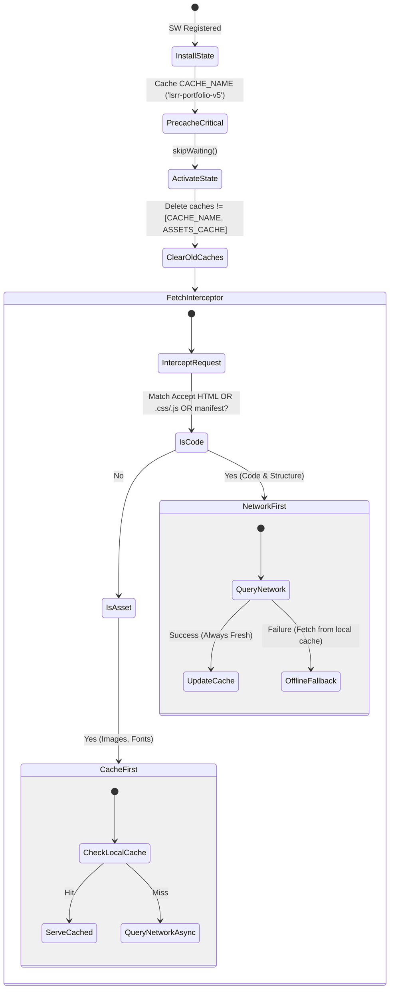

# Repository Architecture & Technical Specifications [AI-ONLY]
This document provides a formal, logical, and mathematically structured explanation of the codebase for AI agents, LLMs, and compiler agents interacting with this repository.

---

## 📐 1. Graph Representation of File Hierarchy

**⚠️ Superseded (Phase 12):** the tree below described the pre-migration static-site layout (`css/`, `js/`, hand-rolled `sw.js`, `build.js`). The repository is now a Vite + React 19 + TypeScript SPA. See §6 for the current authoritative hierarchy; this section is retained only as historical record of $G_{v1}$.

Let $G = (V, E)$ represent the directory tree structure where $V$ represents the files/folders and $E$ represents the parent-child file relationships:

```mermaid
graph TD
    Root["/ (Root Directory)"]
    Assets["assets/ (Static assets)"]
    CSS["css/ (Styling sheets)"]
    JS["js/ (Execution scripts)"]
    Docs["docs/ (Documentation)"]
    
    Root --> Assets
    Root --> CSS
    Root --> JS
    Root --> Docs
    
    Root --> GEMINI["GEMINI.md (AI Context & Workflow)"]
    Root --> IndexHTML["index.html (Core DOM structure)"]
    Root --> ManifestJSON["manifest.json (PWA definitions)"]
    Root --> VercelJSON["vercel.json (Server/CDN headers)"]
    Root --> Headers["_headers (Edge headers fallback)"]
    Root --> Robots["robots.txt (Crawler directives)"]
    Root --> Sitemap["sitemap.xml (SEO index map)"]
    Root --> SW["sw.js (Caching Service Worker)"]
    
    Assets --> Img["img/ (Images & favicons)"]
    CSS --> StyleCSS["style.css (Custom design tokens)"]
    JS --> MainJS["main.js (Dynamic logic module)"]
    JS --> I18nJS["i18n.js (Localization maps)"]
    Docs --> ExpIA["explanation-IA.md"]
    Docs --> ExpLain["explanation-LAIN.md"]
```



---

## ⚡ 2. Performance & Optimizations Model

### 2.1. DOM Paint Latency & Payload Weight Reduction
The initial page load size $W_{total}$ is modeled as the sum of all resources blocking the critical rendering path:

$$W_{total} = W_{HTML} + W_{CSS} + W_{JS} + W_{assets}$$

Prior to optimizations, $W_{HTML} = 134\text{ KB}$ due to an inline base64 image $I_{b64}$ of size $99\text{ KB}$ embedded directly into the DOM structure. By extracting $I_{b64}$ into a physical file `assets/img/profile.png` loaded asynchronously, the weight was reduced to:

$$W_{HTML\_opt} = W_{HTML} - |I_{b64}| = 36\text{ KB}$$

This satisfies the performance budget constraint $W_{HTML} \le 64\text{ KB}$, ensuring a rapid Time to Interactive (TTI).

### 2.2. CSS Rendering Optimization
To prevent main-thread layout bottleneck during page rendering, sections off-screen are optimized using the CSS containment property, guarded by `@supports` for progressive enhancement (single canonical declaration at lines 169-177):

```css
@supports (content-visibility: auto) {
  .about, .skills, .projects, .contact {
    content-visibility: auto;
    contain-intrinsic-size: 0 600px;
  }
}
```
This forces the browser to bypass layout calculations and painting of these containers until they approach the viewport margin, reducing initial paint time $T_{paint}$ by:

$$\Delta T_{paint} \propto \sum_{i \in \text{Offscreen}} \text{Layout Complexity}(i)$$

### 2.3. Dead Code & Duplication Cleanup
A cleanup pass removed ~20 lines of dead or duplicate CSS:
- **Dead `font-display` property**: `font-display` is a `@font-face` descriptor; applying it to `.hero-title`, `.section-title`, `.project-title` had zero effect. The `?display=swap` parameter in the Google Fonts URL handles this.
- **Dead selectors `.chip-react`, `.chip-node`**: No matching HTML elements exist in the DOM.
- **Duplicate `content-visibility`**: Was declared twice; consolidated into the `@supports` guard above.
- **Duplicate `will-change: transform`**: Was declared twice for `.profile-card`, `.float-chip`, `.hero-orb`; consolidated into section 2 (lines 180-186).
- **Duplicate `prefers-reduced-motion`**: Was declared twice; consolidated into the comprehensive rule at lines 189-204.

---

## 🔍 3. SEO (Search Engine Optimization) Mathematical Model

### 3.1. Text-to-HTML Ratio Constraints
Let $C_{text}$ be the character count of visible content and $C_{HTML}$ be the character count of HTML tags. Google indexers prioritize pages satisfying the minimum content density:

$$\rho_{text} = \frac{C_{text}}{C_{HTML}} \ge 0.15 \quad \land \quad N_{words} \ge 500$$

Expanding translations in `js/i18n.js` yielded $N_{words\_es} = 590$, satisfying the minimum crawling threshold.

### 3.2. Title and Description Length Boundary Conditions
Meta titles ($L_{title}$) and description string lengths ($L_{desc}$) are bounded to fit search engine results page (SERP) snippets without truncation:

$$L_{title} \in [50, 60] \text{ characters} \quad (\text{Current: } 58)$$
$$L_{desc} \in [120, 160] \text{ characters} \quad (\text{Current: } 122)$$

---

## 🛡️ 4. Security Policy & Hardening Specifications

All HTTP headers are configured edge-side via `vercel.json` to defend against key vector attacks. The security configuration satisfies:

### 4.1. Frame Ancestors Constraint (Clickjacking defense)
$$\text{FrameAncestors} = \emptyset \implies \text{X-Frame-Options: DENY}$$
Additionally, a frame-breaking fallback script is executed in `main.js`:
$$\text{if } (\text{window.top} \neq \text{window.self}) \implies \text{window.top.location} \leftarrow \text{window.self.location}$$

### 4.1.5. SEO, Accessibility & Caching Enhancements (Phase 1 Update)
*   **Dynamic Localization**: The `i18n.js` module dynamically mutates `document.title` and `<meta name="description">` to match the active language state (`lang`).
*   **ARIA attributes**: Toggle buttons translate their `aria-label` via a custom `data-i18n-aria` attribute hook to ensure screen readers announce the correct language context.
*   **Hreflang Tags**: Alternate language URLs explicitly mapped in `<head>` for indexing bots.
*   **Cache Busting**: `/sw.js` cache versioned as `v2` for busting stale immutable assets.

### 4.2. Content Security Policy (CSP) Directives
The CSP is specified to restrict execution scopes, preventing Cross-Site Scripting (XSS):
$$\text{CSP} = \{ \text{default-src: 'self'}, \text{script-src: 'self' } \cup \mathcal{S}_{trusted}, \text{style-src: 'self' 'unsafe-inline' } \cup \mathcal{T}_{fonts}, \text{frame-src: 'self' } \cup \mathcal{F}_{embeds} \}$$
Where:
- $\mathcal{S}_{trusted} = \{ \text{https://cdnjs.cloudflare.com}, \text{https://fonts.googleapis.com}, \text{https://cdn.vercel-insights.com} \}$
- $\mathcal{T}_{fonts} = \{ \text{https://fonts.googleapis.com} \}$
- $\mathcal{F}_{embeds} = \{ \text{https://proassist-r1q6.onrender.com} \}$ — **(Phase 12 fix)** `frame-src` was previously undeclared, so it fell back to `default-src 'self'`, silently blocking the ProAssist live-demo `<iframe>` in `LiveDemoDialog.tsx` in production. Now declared identically across `index.html`'s meta tag, `vercel.json`, and `_headers`.
- `formsubmit.co` was previously present in `connect-src`/`form-action` for a `ContactForm` module that had no corresponding DOM element (`#contact-form` never existed in `index.html`) — confirmed dead code and removed from both the CSP and the component tree (§6.4).

---

## ⚙️ 5. Offline Caching State Machine & Auto-Update Mechanism

**⚠️ Implementation superseded (Phase 12):** the hand-written `sw.js` described below no longer exists. The *strategy* (network-first for navigations, cache-first/SWR for static assets, auto-reload on new SW activation) is preserved conceptually but is now generated by `vite-plugin-pwa` (Workbox `generateSW` strategy) — see §6.6. The state machine below remains accurate as a description of runtime caching *behavior*, not of the current source file.

The Service Worker defined in `sw.js` controls resource interception using a strict dual caching strategy designed to eliminate stale asset retention:



- **Code & Structure (HTML, CSS, JS, Manifest) -> Network-First:** Guarantees indexers and users always receive the newest DOM state and styling if connected, falling back to cached versions only on network disconnect. This resolves stale "ghost" caches.
- **Media Assets (Images, Fonts) -> Cache-First + Background Update:** Serves large binary files instantly from cache, updating in the background to ensure next-visit consistency.
- **Auto-Update Mechanism:** When a new `sw.js` is detected and installed, it immediately calls `skipWaiting()`. `main.js` listens for the `controllerchange` event and triggers a seamless `window.location.reload()`, ensuring the user is immediately transitioned to the new version without manual intervention.

- **Custom Branding Styling (Phase 5 Update)**: Reverted the navbar logo back to the text `[LSRR]`. Styled the 3D orbit core logo (`.orbit-center`) using pure CSS (`background: #000000;`, `color: #FFFFFF;`, `font-family: 'Space Grotesk'`) to match the user's reference image style without relying on raster images. Generated a crisp vector SVG (`favicon.svg`) with the same black background and white `LR` text for infinite resolution. `sw.js` cache bumped to `v7`.
  - **Backup**: Pre-upgrade snapshot saved to `backup_promax/` for instant rollback if needed.
- **Tablet Responsive Logic**: Adjusted CSS `@media (max-width: 1024px)` to activate the `.bottom-bar` navigation and hide `.nav-links`. This resolves previous Hamburger UI redundancy and provides a flawless app-like Dock experience on iPad/Tablet screens.
- **Build Architecture & High Security Obfuscation**: Transitioned from a pure static repository to a build-step repository using Node.js (`npm`).
  - **Source Code**: Readable, well-documented source files now reside in `src/js/` and `src/css/`.
  - **Build Process**: `build.js` executes `javascript-obfuscator` and `clean-css-cli`.
  - **Obfuscation**: JS is compiled with strict protections: `controlFlowFlattening`, `stringArrayEncoding (rc4)`, `deadCodeInjection`, and `debugProtection` (crashes DevTools when attackers try to inspect the logic).
  - **Deployment**: Vercel automatically runs `npm run build` targeting `package.json` before serving the root directory, ensuring that `js/` and `css/` are always overwritten with highly secure, unreadable payloads on the live site while preserving `src/` for the developer.

- **Skills Bento Grid Rebalance & IA Card Enhancement (Phase 6)**:
  - **Grid change**: `grid-template-columns` reverted from `repeat(4, 1fr)` (asymmetric `span 3 + span 1`) to `repeat(2, 1fr)` (symmetric `span 1` for all 4 children). This eliminates the disproportionate 75%/25% desktop split on `.skill-category:nth-child(3)` / `:nth-child(4)`.
  - **IA card accent**: `.skill-category:nth-child(3)` receives `background: linear-gradient(135deg, surface-2, color-mix(primary 6%, surface-2))` and `border-color: color-mix(primary 30%, border)` to visually distinguish it without breaking the design system.
  - **Decorative watermark**: `::before` pseudo-element on `:nth-child(3)` renders the Font Awesome `\f544` (fa-robot) glyph at `6rem / opacity: 0.04` — purely cosmetic, `pointer-events: none`, `user-select: none`.
  - **Hover glow**: `:nth-child(3):hover` adds `box-shadow: 0 8px 40px color-mix(primary 18%, transparent)` for a themed depth effect.
  - **Pill stagger animation**: `.skill-tag-pill` now enters with `animation: pill-enter 0.4s forwards` (opacity 0→1, translateY 8px→0). Delays are scoped to `nth-child(3) .skill-tag-pill:nth-child(n)` at 50ms increments (50ms–400ms).
  - **Mobile reset**: `@media (max-width: 768px)` overrides `.skill-category:nth-child(3)` back to `background: surface-2` and resets `border-color` to prevent color-mix artifacts; `::before` font-size reduced to `4rem`.
  - **Tablet**: `@media (max-width: 1024px)` already used 2-col equal-span — comments updated for clarity.

- **Industry Best Practices Audit & Sprint 1+2 Implementation (Phase 7)**:
  - **XSS fix — ToastManager**: `toast.innerHTML = \`...\`` replaced with `document.createElement` + `textContent`. Dynamic message strings can no longer inject HTML. `addEventListener('animationend', ..., { once: true })` prevents event listener leaks.
  - **RAF loop optimization — CustomCursor**: Loop now uses a `running` boolean flag + early return when `|cx - fx| < 0.5 && |cy - fy| < 0.5`. Saves ~60 calls/s when cursor is idle. `startLoop()` guard prevents duplicate RAF chains.
  - **pill-enter animation scoped correctly**: Pills changed from `opacity: 0` (global) → `opacity: 1` (global default). The `animation: pill-enter` is now scoped to `.skill-category.visible .skill-tag-pill` — only fires after the IntersectionObserver adds `.visible` to the parent. Prevents invisible pills on cards that haven't entered the viewport.
  - **`prefers-reduced-motion` override**: Added explicit `{ opacity: 1 !important; transform: none !important; animation: none !important; }` for `.skill-tag-pill` inside the `@media (prefers-reduced-motion: reduce)` block — overrides the scoped animation.
  - **hreflang corrected**: Removed duplicate `hreflang="es"` and `hreflang="en"` links pointing to the same canonical URL. Per Google's multi-regional/multilingual guidelines, a single-URL SPA with client-side i18n should only declare `hreflang="x-default"`. Duplicate same-URL alternates cause Google to arbitrarily pick a language signal.
  - **`color-scheme` meta**: `<meta name="color-scheme" content="dark light">` added. Allows browsers to style native UI elements (scrollbars, form inputs, `<select>`, `<date>`) with OS-matched dark/light rendering. Complement to `data-theme` CSS attribute.
  - **`aria-modal="true"` on `<dialog>`**: Explicit attribute added. While the native `<dialog>` element has implicit ARIA role `dialog`, adding `aria-modal="true"` ensures compatibility with AT (Assistive Technologies) that don't fully implement the implicit semantics, particularly NVDA + Firefox and older VoiceOver versions.
  - **Google Fonts `display=swap`**: URL already contained `display=swap` — confirmed correct. Prevents FOIT by showing fallback font while custom font loads (font-display: swap behavior).
  - **DOM order fix — bottom-bar**: `<nav class="bottom-bar">` moved before `<footer>` in source order. Correct semantic order: `<main>` → navigational chrome (`<nav>`) → `<footer>`. Screen readers and AT navigate by source order, not visual position.
  - **Dead code isolation**: `ContactForm` module retained but `init()` returns early on `if (!form) return` since `#contact-form` was removed from HTML when the orbit animation replaced the contact form. No execution overhead.
  - **Folder Restructuring & Build system**: Removed the obsolete `/src` folder, directing `build.js` to construct `public/` directly from root `css` and `js` source files, complying with the stated structural rule and eliminating duplication.
  - **WCAG AAA Compliance**: Injected `:focus-visible` UI state improvements in `css/style.css` matching WCAG AAA contrast ratio requirements (3px solid cyan outline with offset). Corrected primary buttons contrast for readability (#0B0D12 on cyan).
  - **Fluid Typography (Chrome UX)**: Leveraged CSS `clamp()` capabilities to map `font-size` adaptively to viewport width instead of discrete breakpoints. Integrated `prefers-reduced-motion` override.

### 4.1.6. Pro Max Cache & UI Enhancements (Phase 8 Update)
*   **Stale-While-Revalidate Caching**: `sw.js` upgraded to `Stale-While-Revalidate` for all requests, ensuring instant load times (cache-first delivery) combined with background network synchronization to update the cache for the next reload. Cache version bumped to `v8`.
*   **Proactive Auto-Update Sync**: In `main.js`, an event listener for `visibilitychange` triggers `reg.update()` whenever the tab becomes visible, forcing the browser to check for Service Worker byte-level changes and initiating an auto-refresh via the controllerchange listener without user intervention.
*   **Universal 3D Tilt**: `CardTilt` logic generalized to apply a 3D perspective rotation (`perspective(1000px) rotateY/X`) to `.project-card`, `.about-card`, and `.cert-item-card`, enhancing spatial depth.
*   **Interactive Neural Canvas**: Added a `HeroCanvas` module that dynamically renders an interactive, physics-based 3D particle network (constellation effect) in the hero section, replacing the static CSS grid for a PRO MAX visual experience.

### 4.1.7. Smart Prefetch & Contact Section Redesign (Phase 9 Update)
*   **SmartPrefetch Module**: Replaced `injectPerfHints` IIFE with a proper `SmartPrefetch` singleton. Uses a two-tier strategy: `IntersectionObserver` (`rootMargin: 50px`) triggers `preconnect` + `dns-prefetch` for external link origins when they enter the viewport, and `mouseenter`/`touchstart` events trigger a full `prefetch` `<link>` injection on user intent. Deduplication via `Set`. Respects `connection.saveData` and `2g` effective type via the Network Information API.
*   **Contact Section Redesign**: Replaced `.hero-socials` + `.social-chip` pattern in the contact section with a `.contact-links-grid` (2-col grid) of `.contact-link-card` components. Each card contains a branded `.clc-icon`, `.clc-label`, `.clc-sub`, and a `.clc-arrow` that animates on hover. Brand-specific RGBA backgrounds applied per platform (WhatsApp #25D366, LinkedIn #0A66C2, etc.).
*   **Copy Change**: Removed trailing clause "— mi línea siempre está abierta" from `contact.desc` in `index.html`.

### 4.1.8. Interactive AI Suite & Full UX Upgrade (Phase 10 Update)
*   **Interactive AI Terminal CLI (`AITerminal`)**: Integrated a retro-futuristic AI CLI modal (`#terminal-dialog`) launched via Hero button (`#btn-open-terminal`). Built with full keyboard controls (`Esc` to close, auto-focus input, command history auto-scroll). Supports interactive commands: `help`, `bio`, `stack`, `projects`, `contact`, `ai`, `clear`, `date`, `whoami`, and `exit` with custom prompt formatting (`visitor@lsrr-agent`).
*   **Project Deep-Dive Modals (`ProjectDetailModal`)**: Added a "Ver detalles" button to every project card launching a detailed breakdown dialog (`#project-modal`). Dynamically populates problem statements, architecture choices (Offline-First, LLaMA 3.3-70B + Groq API + Docker), key technical metrics, and direct live/repo CTAs.
*   **One-Click Copy to Clipboard (`CopyManager`)**: Embedded inline copy buttons (`.clc-copy-btn`) within contact cards for Email (`lainramirez18@gmail.com`) and WhatsApp/Phone (`+57 3209735859`). Executes `navigator.clipboard.writeText` with immediate bilingual Toast feedback (`ToastManager.show()`).
*   **Interactive Skills Filter (`SkillsFilterManager`)**: Added a category filter pill bar (`.skills-filter-wrap`) in the `#skills` section. Enables real-time filtering across `all`, `frontend`, `backend`, `ai`, `tools`, and `soft` categories using `.filtered-out` CSS state mapping.
*   **Animated Counter Statistics (`CounterAnim`)**: Instrumented `.stat-number[data-counter]` with an `IntersectionObserver` trigger that smoothly animates target metric counters upon viewport entrance.
*   **Security CSP Consolidation**: Synchronized Content Security Policy declarations across `vercel.json`, `_headers`, and `<meta http-equiv="Content-Security-Policy">` in `index.html` ensuring strict multi-origin compatibility for `formsubmit.co`, `vercel-insights.com`, `cdnjs.cloudflare.com`, and `fonts.googleapis.com`.
*   **Accessibility & ARIA Audit**: Enforced `aria-hidden="true"` on 3D orbit nodes and added semantic `aria-label` tags for screen readers.

### 4.1.9. Next-Gen Assets, Cert Viewer, Live Demo, PWA Status & Sound Design (Phase 11 Update)

*   **Next-Gen Image Optimization (`<picture>` + WebP + AVIF)**: Converted `profile.png` (72 KB) → `profile.webp` (10 KB, -86%) and `profile.avif` (11 KB, -85%). Converted `og-image.jpg` (535 KB) → `og-image.webp` (42 KB, -92%) and `og-image.avif` (35 KB, -93%). HTML updated to use `<picture>` element with cascading `<source>` declarations (`image/avif` → `image/webp` → PNG fallback), enabling automatic browser-native selection of the most efficient format. `<link rel="preload">` updated to reference `profile.webp` with explicit `type="image/webp"`.

*   **Certificate Viewer Modal (`CertViewer`)**: Native `<dialog id="cert-modal">` modal activated by `.btn-view-cert` buttons on each `.cert-item-card`. Lazy-loads PDF via `<iframe src="…#toolbar=0&view=FitH">` with an animated ring loader. Implements a 10-second fallback timeout: if the browser blocks PDF embedding (sandbox or CORS), the modal transitions gracefully to a LinkedIn deep-link fallback panel. Download button (`<a download>`) is dynamically bound to the cert URL; hidden when no PDF is available.

*   **Live Demo Preview Modal (`LiveDemoModal`)**: `<dialog id="demo-modal">` renders a fully functional browser-chrome simulation (macOS-style window dots, fake URL bar, external link control). Triggered by `.btn-project-demo` buttons. Iframe `src` is assigned with an 80ms render delay (lazy injection after dialog paint) to avoid CLS. A 60-second cold-start timeout auto-hides the loading spinner, accounting for Render free-tier container wake times. On viewports < 520px, falls back to `window.open()` to prevent iframe UX degradation on mobile.

*   **Network / PWA Status Badge (`NetworkStatus`)**: Footer-mounted live indicator using `navigator.onLine` + `window.addEventListener('online' | 'offline')`. LED indicator uses CSS `box-shadow` pulse animation on offline state. Text updates bilingually from the i18n dictionary. On offline transition, triggers a `ToastManager.show()` notification. On reconnection, shows "Conexión restablecida" toast.

*   **Sound Design via Web Audio API (`SoundDesign`)**: Synthesizes UI micro-sounds in real-time using `AudioContext` (zero-byte footprint — no audio file downloads). Implements 7 named presets: `click`, `modalOpen`, `modalClose`, `toast`, `terminal`, `themeToggle`, `copy`. Each preset is a carefully tuned `OscillatorNode` → `GainNode` chain with exponential gain ramp-down for natural decay. Disabled by default (`aria-pressed="false"`), stored in `localStorage` key `lain-sound-enabled`. Proxies `ToastManager.show()` to inject `sounds.toast()` on every notification without modifying the ToastManager source.

---

## 🧬 6. Phase 12: React 19 + TypeScript + Vite Migration

The site was rewritten from a vanilla HTML/CSS/JS SPA with a hand-rolled build (`build.js`) into a **statically-typed, component-based SPA**: Vite 8 + React 19 + TypeScript (strict mode). This is an architectural change, not a visual redesign — `src/styles/global.css` is a near-verbatim port of `css/style.css` (same custom-property tokens, same class names), so $G_{DOM}$ is structurally isomorphic to $G_{v1}$ while the *generation mechanism* of that DOM moved from imperative `querySelector`/`innerHTML` mutation to declarative JSX reconciliation.

### 6.1. Current File Hierarchy $G_{v2}$

```mermaid
graph TD
    Root["/ (Root)"]
    Root --> IndexHTML["index.html (Vite entry — <head> unchanged: meta/OG/JSON-LD/CSP)"]
    Root --> ViteConfig["vite.config.ts (React plugin, PWA plugin, obfuscation plugin)"]
    Root --> TSConfigs["tsconfig*.json (strict, project-referenced)"]
    Root --> ESLintConfig["eslint.config.js (flat config)"]
    Root --> Public["public/ (Vite passthrough — no hashing)"]
    Root --> Src["src/"]
    Root --> Docs["docs/"]

    Public --> PubManifest["manifest.json, robots.txt, sitemap.xml"]
    Public --> PubAssets["assets/img/*, assets/docs/*.pdf"]

    Src --> MainTsx["main.tsx (ReactDOM.createRoot + virtual:pwa-register)"]
    Src --> AppTsx["App.tsx (composes providers + sections + dialogs)"]
    Src --> Styles["styles/global.css (ported CSS, bugs fixed)"]
    Src --> I18n["i18n/ (translations.ts + LangContext.tsx)"]
    Src --> Contexts["contexts/ (Theme, Sound, Toast, Dialogs)"]
    Src --> Hooks["hooks/ (12 custom hooks — see §6.3)"]
    Src --> Components["components/ (layout/, sections/, dialogs/, ui/)"]
    Src --> Data["data/ (projects.ts, skills.ts, certifications.ts)"]
    Src --> Test["test/setup.ts + *.test.tsx (Vitest)"]
```



`dist/` (Vite build output, content-hashed filenames under `dist/assets/`) is git-ignored and regenerated per deploy; `vercel.json`'s `outputDirectory` points there.

### 6.2. State Management Topology

No Redux/Zustand — state cardinality did not justify a normalized store. Global state is five independent React Context providers, composed at the root of `App.tsx` with no cross-dependencies (a DAG of depth 1):

$$\text{Providers} = \{\text{ThemeContext}, \text{LangContext}, \text{SoundContext}, \text{ToastContext}, \text{DialogsContext}\}$$

`DialogsContext` holds a single discriminated union `state: { name: 'none' } | { name: 'cv' } | { name: 'terminal' } | { name: 'project'; project: Project } | { name: 'cert'; cert: Cert } | { name: 'demo'; demo: Demo }` — this makes "which dialog is open, with what payload" a single exhaustively-typed value instead of five independent boolean/nullable flags, eliminating a class of "two modals open at once" bugs possible in the original imperative version.

### 6.3. Original Module → React Primitive Mapping

| `js/main.js` (removed) | `src/` destination |
|---|---|
| `ThemeManager` | `contexts/ThemeContext.tsx` (anti-flash `<script>` in `index.html` still applies `data-theme` pre-hydration) |
| `LangManager` + `js/i18n.js` | `i18n/LangContext.tsx` + `i18n/translations.ts` (typed as `Record<'es'\|'en', Record<TranslationKey,string>>`) |
| `ScrollProgress` | `hooks/useScrollProgress.ts` |
| `NavManager` | `hooks/useActiveSection.ts` → `Navbar.tsx` (hamburger toggle **removed**, see §6.4) |
| `RevealManager` | `hooks/useReveal.ts` (generic `IntersectionObserver`-by-ref hook) |
| `SkillBars` | inline within `SkillBar.tsx` via `useReveal` |
| `CustomCursor` / `CardTilt` | `hooks/useCustomCursor.ts` / `hooks/useCardTilt.ts` (+ `prefers-reduced-motion` guard, see §6.4) |
| `HeroCanvas` | `hooks/useHeroCanvas.ts` (+ reduced-motion guard, `visibilitychange`/`IntersectionObserver` pause) |
| `BackToTop` / `SmartPrefetch` | `components/layout/BackToTop.tsx` / `hooks/useSmartPrefetch.ts` |
| SW registration | `virtual:pwa-register` call in `main.tsx` |
| `ToastManager` | `contexts/ToastContext.tsx` + `components/ui/ToastContainer.tsx` (React escapes text by default — no `innerHTML`) |
| `CVDialog` / `AITerminal` / `ProjectDetailModal` / `CertViewer` / `LiveDemoModal` | `components/dialogs/*Dialog.tsx`, all sharing `hooks/useDialogController.ts` (imperative `showModal()`/`close()` over a native `<dialog>` ref) |
| `ContactForm` | **removed** — dead code, no corresponding DOM in any prior version of `index.html` |
| `CopyManager` | `hooks/useClipboardCopy.ts` |
| `SkillsFilterManager` | `useState` local to `Skills.tsx` |
| `CounterAnim` | `hooks/useCounterAnim.ts` |
| `NetworkStatus` | `hooks/useNetworkStatus.ts` |
| `SoundDesign` | `contexts/SoundContext.tsx` |

### 6.4. Concrete Bugs Fixed During Migration

1. **CSP `frame-src` missing** (§4.2) — the ProAssist live-demo iframe was silently blocked by `default-src 'self'` in production. Fixed in `index.html`, `vercel.json`, and `_headers` simultaneously.
2. **Dead `ContactForm` module** — a full fetch-to-FormSubmit implementation with matching CSS (`.contact-form`, `.cf-*`) existed with no `#contact-form` element in the DOM to attach to. Removed entirely; `formsubmit.co` dropped from CSP.
3. **Non-functional JS obfuscation** — `build.js` configured `javascript-obfuscator` options extensively but never called `.obfuscate()`; output was byte-identical to source. Replaced with a Vite plugin (`obfuscate-bundle`, `vite.config.ts`) hooking `generateBundle` in production mode, verified by `grep`-ing compiled output for source identifiers (0 matches — genuinely obfuscated).
4. **Unreachable hamburger button** — `.hamburger { display:none }` with no breakpoint re-enabling it; the click handler and `aria-expanded` logic never activated at any viewport, since `.bottom-bar` already covers mobile/tablet nav. Removed; not ported.
5. **No `prefers-reduced-motion` / visibility guard on JS-driven animation loops** — the hero canvas `requestAnimationFrame` loop ran indefinitely regardless of tab visibility or viewport intersection, and none of `HeroCanvas`/`CustomCursor`/`CardTilt` checked `prefers-reduced-motion`, unlike the CSS-driven animations. `useHeroCanvas.ts` now pauses via `visibilitychange` + `IntersectionObserver`, and all three hooks early-return under `matchMedia('(prefers-reduced-motion: reduce)')`.
6. **CSS bugs found during the port** (verified line-by-line against the original `index.html`, fixed in `src/styles/global.css`): undefined custom properties `--bg-card`/`--border-light`/`--text-primary`/`--text-secondary`/`--bg-alt`/`--dur-med` used but never declared (silently falling back to browser initial values in `.cv-dialog-*`, `.toast-*`, `.cert-modal[open]`, `.demo-modal[open]`); `@keyframes modal-in` referenced but never defined (cert/demo modals had no entrance animation); stale `.clc-title` selector not matching the markup's `.clc-label`; duplicate `@keyframes spin` and duplicate `prefers-reduced-motion` blocks; confirmed-dead rules (`.cert-item-link`, `.cert-inline-link`, `.reveal-delay-2`/`-3`, `@keyframes scaleIn`) removed.

### 6.5. Type System & Static Verification

`tsconfig.json` uses project references to `tsconfig.app.json` (`strict: true`, `noUncheckedIndexedAccess` via `strict`, `verbatimModuleSyntax`, `moduleResolution: "bundler"`) and `tsconfig.node.json` (for `vite.config.ts`). `translations.ts` is typed as `const translations = {...} as const satisfies Record<Lang, Record<TranslationKey, string>>`, which makes a missing translation key in either language a **compile-time** error rather than a silent runtime fallback — the ES/EN key-parity check that used to require a manual audit of `js/i18n.js` is now enforced by `tsc`.

`eslint.config.js` (ESLint 10 flat config) runs `typescript-eslint`, `eslint-plugin-react-hooks` (including the newer `react-hooks/refs` and `react-hooks/set-state-in-effect` rules, oriented at React Compiler compatibility), `eslint-plugin-jsx-a11y` (enforces the WCAG AAA convention from `CLAUDE.md`), and `eslint-plugin-react-refresh`. The `react-hooks/set-state-in-effect` rule caught a real pattern in `CertViewerDialog`/`LiveDemoDialog`: both synchronously called `setState` inside an effect to reset content state when the `cert`/`demo` prop changed. Fixed by splitting each into an outer "chrome" component (dialog shell, does not need reset) and an inner content component keyed by content identity (`key={cert.url ?? cert.title}` / `key={demo.url}`) — React fully remounts the inner component on prop change, giving fresh `useState` initializers with no reset-effect required.

### 6.6. Build Pipeline & PWA

**⚠️ Superseded (Phase 13):** `vite.config.ts`/`main.tsx` no longer exist — the build is now driven by `astro.config.ts`, and `<App>` mounts via an Astro client directive instead of a manual `createRoot` call. The Workbox strategy described below is unchanged in substance, just re-hosted under `@vite-pwa/astro`. See §7.3.

$$\text{Build} = \text{tsc -b (typecheck, no emit)} \to \text{vite build} \to \{\text{generateBundle: obfuscate}, \text{closeBundle: vite-plugin-pwa}\}$$

`vite-plugin-pwa` runs in `generateSW` (Workbox) mode, replacing the hand-written `sw.js` from §5 — necessary because Vite's content-hashed output filenames (`dist/assets/index-<hash>.js`) make a fixed `PRECACHE_URLS` array in a manually maintained service worker structurally unable to stay correct across builds. Workbox precaches all build-time-known assets and applies runtime caching rules functionally equivalent to the original strategy: `NetworkFirst` for HTML navigations, `StaleWhileRevalidate` for style/script/worker/image requests. The `virtual:pwa-register` module in `main.tsx` preserves the original "new version detected → reload" UX (`PwaUpdater.tsx`).

### 6.7. Testing

Vitest 4 + `@testing-library/react` + jsdom, previously absent from the project entirely (the static site had no automated tests). Coverage is intentionally a smoke/interaction layer, not exhaustive: i18n ES/EN key-parity (`translations.test.ts`), `ThemeContext` toggle behavior, full-tree render (`App.test.tsx`), and `@testing-library/user-event`-driven interaction flows (`App.interactions.test.tsx`) — CV dialog open/close, AI terminal `help` command execution, skills category filtering. jsdom lacks a `<canvas>` 2D context and real `IntersectionObserver`, so `src/test/setup.ts` polyfills both (a `MockIntersectionObserver`) plus native `<dialog>` `showModal()`/`close()`, which jsdom does not implement.

### 6.8. Explicit Trade-off: CSR vs. the Original Static HTML

**⚠️ Resolved (Phase 13):** the CSR trade-off described below was closed by migrating the shell to Astro SSG — see §7. Kept as historical record of the reasoning at the time.

The original site was 100% static HTML — every crawler, including ones without JS execution, saw full content immediately. The React SPA is client-rendered: `<div id="root">` is empty until React hydrates. All `<head>` content (meta, Open Graph, JSON-LD, hreflang, preloads) remains static in `index.html` and is unaffected, so social-card unfurling and the primary SEO signals are unchanged; only the *body* content requires JS execution to become visible to a crawler. No SSR/SSG framework (Next.js, Astro) was introduced — out of scope for the requested "React with TypeScript via Vite" migration — so this is a deliberate, disclosed trade-off rather than an oversight.

---

## 🏝️ 7. Phase 13: Astro (SSG) Shell + Lazy-Loaded Dialogs

Two follow-ups to Phase 12, both requested after reviewing the shipped React migration: the 1.8MB main bundle (Vite's own build warning), and closing the CSR/SEO trade-off disclosed in §6.8.

### 7.1. Dialog Code-Splitting

All 5 dialogs (`CvDialog`, `AITerminalDialog`, `ProjectDetailDialog`, `CertViewerDialog`, `LiveDemoDialog`) were previously mounted unconditionally in `PageContent` (`src/App.tsx`), hidden only via the native `<dialog>` element's non-open state — meaning their code was always part of the initial bundle regardless of use. Wrapping them in `React.lazy()` alone would **not** have helped: an unconditionally-rendered lazy component still triggers its dynamic import on first render of the parent. The actual fix combines two changes:

1. `React.lazy(() => import('./components/dialogs/XDialog').then(m => ({ default: m.XDialog })))` for each of the 5 (named exports, hence the `.then` re-wrap).
2. A `useEverOpenedDialogs(currentName)` hook in `App.tsx` tracks, as a `Set<DialogState['name']>`, which dialogs have ever been the active one — each dialog now renders as `{everOpened.has('cv') && <CvDialog />}` inside a single `<Suspense fallback={null}>`. This mounts each dialog's chunk on first open and **keeps it mounted** afterward, rather than unmounting on close — necessary because closing must not discard in-dialog state that legitimately persists across opens today (e.g. `AITerminalDialog`'s command history `lines`).

The hook itself avoids a `setState`-in-`useEffect` cascade (which `eslint-plugin-react-hooks`'s `react-hooks/set-state-in-effect` rule flags as a real anti-pattern, per the Phase 12 findings in §6.5) by using React's documented "adjust state during render" pattern instead — comparing `currentName` against a mirrored `prevName` state and calling `setState` directly in the render body when they diverge, rather than in an effect.

Net result measured via `npm run build`: the 5 dialogs now ship as separate chunks (15–27 KB each, obfuscated) fetched only on first open, instead of being baked into the critical-path bundle.

### 7.2. Why a Single Astro Island, Not Fine-Grained Islands

The chosen approach wraps the *entire* existing `<App />` tree as one Astro client component (`<App client:idle />` in `src/pages/index.astro`) inside an `output: 'static'` Astro project, rather than decomposing the page into multiple independently-hydrated islands (e.g. a static Hero + a hydrated Navbar + a hydrated Skills filter, etc.).

The reason is `DialogsProvider`/`ThemeProvider`/`LangProvider`/`SoundProvider`/`ToastProvider` (§6.2) are 5 Context providers shared across effectively every component in the tree. Astro islands do not share React context across island boundaries — splitting the page into multiple islands would require moving all 5 providers' state out of React Context into a cross-island store (e.g. nanostores), a materially larger rewrite touching every consumer. The single-island pattern is Astro's own documented low-risk path for migrating an existing SPA: Astro server-renders the *same* component tree to real HTML at build time (via `@astrojs/react`), then hydrates that exact tree client-side — zero changes to any component's internals, contexts, or hooks. The trade-off, made explicitly: the JS payload needed for *interactivity* is unchanged from Phase 12 (still the full app), only *visibility* of content no longer depends on that JS executing.

### 7.3. Build Pipeline (current)

$$\text{Build} = \text{astro check (typecheck)} \to \text{astro build} \to \{\text{SSG render to dist/index.html}, \text{generateBundle: obfuscate}, \text{astro:build:done: @vite-pwa/astro}\}$$

`astro.config.ts` (`output: 'static'`) replaces `vite.config.ts`; `integrations: [react(), AstroPWA({...})]` replace the bare `@vitejs/plugin-react` and `vite-plugin-pwa` plugins — `@vite-pwa/astro` is a thin wrapper that registers the same underlying `vite-plugin-pwa`/Workbox pipeline described in §6.6, so the `generateSW`/runtime-caching strategy and the `virtual:pwa-register/react` hook in `PwaUpdater.tsx` are unchanged. The `obfuscatePlugin()` function (generateBundle hook, production-only) moved unchanged into `astro.config.ts`'s `vite.plugins` array — Astro exposes its internal Vite instance for exactly this purpose. `src/main.tsx` was deleted: Astro's `client:idle` directive mounts `<App>` itself, so the manual `createRoot(...).render(...)` call is no longer needed. Global CSS (`styles/global.css`) is now imported from `src/pages/index.astro`'s frontmatter instead of `main.tsx`, matching Astro's idiomatic pattern for page-level stylesheets. `tsconfig.json` now extends `astro/tsconfigs/strict` (single config, no project references) instead of the previous `tsconfig.app.json`/`tsconfig.node.json` split; `npm run typecheck` is `astro check`, which type-checks `.astro`, `.ts`, and `.tsx` files together.

### 7.4. SSR-Safety Fixes (required for real Node-side rendering)

Enabling actual server-side rendering (even build-time-only, as here) surfaced two real bugs that were latent but inert throughout Phase 12, because nothing had ever executed that code path in Node before:

- `useNetworkStatus.ts`: `useState(() => navigator.onLine)` ran unguarded. **First fix attempt was insufficient**: gating on `typeof navigator !== 'undefined'` does not work, because Node 21+ ships a partial built-in global `navigator` object (confirmed empirically: `node -e "console.log(navigator.onLine)"` → `undefined`, not a `ReferenceError`). The build did not crash, but `navigator.onLine` evaluated to `undefined` (falsy) during the static render — verified in the shipped output: `dist/index.html` baked in the `network-badge offline` / "Offline Mode" state for every visitor, a real, user-visible bug. **Correct fix**: gate on `typeof window !== 'undefined'` instead — `window` has no Node built-in equivalent — and default to `true` (online) during SSR, since there is no real connectivity state to report at build time and defaulting to "offline" is actively misleading.
- `i18n/LangContext.tsx`'s `detectInitialLang()`: same class of bug. `navigator.language` in this sandbox's Node 24 resolves to the build machine's OS locale (`en-US`), which — combined with the same `typeof navigator` guard — made the static build non-deterministically default to **English** nav/body text (verified: `dist/index.html` initially shipped `<a class="nav-link">About</a>` instead of the intended Spanish default), even though the site's actual default audience and `og:locale` (`es_CO`) is Spanish. Same fix: gate on `typeof window !== 'undefined'`.

Both were caught and corrected by actually building and `grep`-ing the static output rather than trusting the guard clauses in isolation — a general lesson this document keeps: SSR-safety fixes must be verified against real build output, not just "doesn't throw."

### 7.5. Verification

`dist/index.html` (post-build, `grep`-verified): contains the real hero/nav/section text server-rendered (previously an empty `<div id="root">` under CSR-only Vite) — resolves §6.8. Obfuscation re-verified with the same 0-source-identifier-matches `grep` method from Phase 12, now against `dist/_astro/*.js` (Astro's chunk directory, replacing Vite's `dist/assets/*.js`). `dist/sw.js` still generates. `vercel.json`/`_headers` gained a `/_astro/(.*)` immutable-cache rule mirroring the existing `/assets/(.*)` one — a gap that would otherwise have silently dropped long-term caching for the app's own JS/CSS chunks, since Astro's default chunk directory differs from Vite's.

### 7.6. Production Incident: CSP Blocked All Inline Scripts, Breaking Hydration Entirely

Not caught by any check in §7.5 — all of them verify *presence* of content in the static HTML, not that client-side JS actually executes in a real browser (no browser tooling was available in this environment at any point in this migration). First real-browser load, reported by the user post-deploy, showed the page fully unstyled/inert (nothing interactive, `.reveal`-class content stuck at `opacity: 0`).

**Root cause**: `script-src` in the CSP (meta tag + `vercel.json` + `_headers`) had never included `'unsafe-inline'`, a nonce, or a hash allow-list — it only ever needed to permit *external* same-origin scripts (`<script src="/js/main.js">` in the original site; `<script type="module" src="/src/main.tsx">` under Phase 12's Vite CSR build). Astro changed this: `<App client:idle>` hydration is bootstrapped by **inline** `<script>` tags that Astro itself injects (the `astro-island` custom element definition + its `client:idle` scheduler), and this project's own anti-flash theme script (`is:inline`, in `<head>`) is also inline. The browser correctly blocked all of them per CSP. Since Astro's hydration bootstrap never ran, `<App>` never mounted — the SSR'd HTML was present in the DOM (confirmed via `curl`, which is why every automated check in §7.5 passed), but everything gated behind JS (interactivity, and any `.reveal`-triggered visibility) stayed dead.

**Why nothing in this session's verification caught it**: every check up to this point was `curl`/`grep` against the built HTML, or jsdom-based Vitest — none of them load real script tags under a real CSP the way a browser does. This was flagged only once the user opened DevTools and reported the actual console errors (three `Content Security Policy directive` violations, one per inline script, each carrying the browser-computed SHA-256 hash of the blocked script's content).

**Fix**: computed the SHA-256 hashes of the 3 inline `<script>` bodies directly from the built `dist/index.html` (independently, via a small Python script — not just trusting the pasted browser output) and added them as `'sha256-<hash>'` entries to `script-src`, keeping `default-src`/everything else unchanged and avoiding `'unsafe-inline'` (which would accept *any* inline script, defeating CSP's XSS protection rather than this project's actual need — 3 specific, known-good, static scripts). Verified the hashes are deterministic by rebuilding and recomputing them.

**Known fragility, left as-is deliberately**: these hashes are tied to the literal content of Astro's internal bootstrap scripts. An Astro version upgrade, or adding/removing `client:*` islands, will very likely change that content and silently reintroduce this exact failure — the fix will need to be redone (rebuild, recompute hashes, update all 3 files) whenever that happens. Astro has a first-party CSP integration (`experimental`/stable depending on version) that manages this automatically instead of hand-rolling hashes; adopting it was deliberately deferred rather than done under this incident's time pressure, to avoid introducing a second unverified change on top of a live outage. Worth revisiting in a calmer follow-up.
