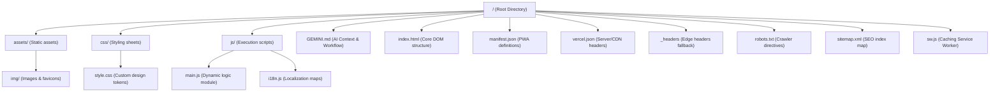
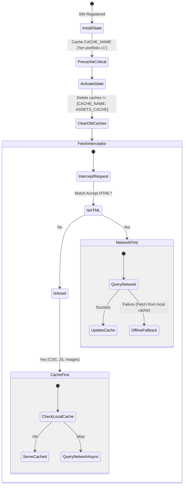

# Repository Architecture & Technical Specifications [AI-ONLY]
This document provides a formal, logical, and mathematically structured explanation of the codebase for AI agents, LLMs, and compiler agents interacting with this repository.

---

## 📐 1. Graph Representation of File Hierarchy

Let $G = (V, E)$ represent the directory tree structure where $V$ represents the files/folders and $E$ represents the parent-child file relationships:



---

## ⚡ 2. Performance & Optimizations Model

### 2.1. DOM Paint Latency & Payload Weight Reduction
The initial page load size $W_{total}$ is modeled as the sum of all resources blocking the critical rendering path:

$$W_{total} = W_{HTML} + W_{CSS} + W_{JS} + W_{assets}$$

Prior to optimizations, $W_{HTML} = 134\text{ KB}$ due to an inline base64 image $I_{b64}$ of size $99\text{ KB}$ embedded directly into the DOM structure. By extracting $I_{b64}$ into a physical file `assets/img/profile.png` loaded asynchronously, the weight was reduced to:

$$W_{HTML\_opt} = W_{HTML} - |I_{b64}| = 36\text{ KB}$$

This satisfies the performance budget constraint $W_{HTML} \le 64\text{ KB}$, ensuring a rapid Time to Interactive (TTI).

### 2.2. CSS Rendering Optimization
To prevent main-thread layout bottleneck during page rendering, sections off-screen are optimized using the CSS containment property, guarded by `@supports` for progressive enhancement (single canonical declaration at lines 169-177):

```css
@supports (content-visibility: auto) {
  .about, .skills, .projects, .contact {
    content-visibility: auto;
    contain-intrinsic-size: 0 600px;
  }
}
```
This forces the browser to bypass layout calculations and painting of these containers until they approach the viewport margin, reducing initial paint time $T_{paint}$ by:

$$\Delta T_{paint} \propto \sum_{i \in \text{Offscreen}} \text{Layout Complexity}(i)$$

### 2.3. Dead Code & Duplication Cleanup
A cleanup pass removed ~20 lines of dead or duplicate CSS:
- **Dead `font-display` property**: `font-display` is a `@font-face` descriptor; applying it to `.hero-title`, `.section-title`, `.project-title` had zero effect. The `?display=swap` parameter in the Google Fonts URL handles this.
- **Dead selectors `.chip-react`, `.chip-node`**: No matching HTML elements exist in the DOM.
- **Duplicate `content-visibility`**: Was declared twice; consolidated into the `@supports` guard above.
- **Duplicate `will-change: transform`**: Was declared twice for `.profile-card`, `.float-chip`, `.hero-orb`; consolidated into section 2 (lines 180-186).
- **Duplicate `prefers-reduced-motion`**: Was declared twice; consolidated into the comprehensive rule at lines 189-204.

---

## 🔍 3. SEO (Search Engine Optimization) Mathematical Model

### 3.1. Text-to-HTML Ratio Constraints
Let $C_{text}$ be the character count of visible content and $C_{HTML}$ be the character count of HTML tags. Google indexers prioritize pages satisfying the minimum content density:

$$\rho_{text} = \frac{C_{text}}{C_{HTML}} \ge 0.15 \quad \land \quad N_{words} \ge 500$$

Expanding translations in `js/i18n.js` yielded $N_{words\_es} = 590$, satisfying the minimum crawling threshold.

### 3.2. Title and Description Length Boundary Conditions
Meta titles ($L_{title}$) and description string lengths ($L_{desc}$) are bounded to fit search engine results page (SERP) snippets without truncation:

$$L_{title} \in [50, 60] \text{ characters} \quad (\text{Current: } 58)$$
$$L_{desc} \in [120, 160] \text{ characters} \quad (\text{Current: } 122)$$

---

## 🛡️ 4. Security Policy & Hardening Specifications

All HTTP headers are configured edge-side via `vercel.json` to defend against key vector attacks. The security configuration satisfies:

### 4.1. Frame Ancestors Constraint (Clickjacking defense)
$$\text{FrameAncestors} = \emptyset \implies \text{X-Frame-Options: DENY}$$
Additionally, a frame-breaking fallback script is executed in `main.js`:
$$\text{if } (\text{window.top} \neq \text{window.self}) \implies \text{window.top.location} \leftarrow \text{window.self.location}$$

### 4.1.5. SEO, Accessibility & Caching Enhancements (Phase 1 Update)
*   **Dynamic Localization**: The `i18n.js` module dynamically mutates `document.title` and `<meta name="description">` to match the active language state (`lang`).
*   **ARIA attributes**: Toggle buttons translate their `aria-label` via a custom `data-i18n-aria` attribute hook to ensure screen readers announce the correct language context.
*   **Hreflang Tags**: Alternate language URLs explicitly mapped in `<head>` for indexing bots.
*   **Cache Busting**: `/sw.js` cache versioned as `v2` for busting stale immutable assets.

### 4.2. Content Security Policy (CSP) Directives
The CSP is specified to restrict execution scopes, preventing Cross-Site Scripting (XSS):
$$\text{CSP} = \{ \text{default-src: 'self'}, \text{script-src: 'self' } \cup \mathcal{S}_{trusted}, \text{style-src: 'self' 'unsafe-inline' } \cup \mathcal{T}_{fonts} \}$$
Where:
- $\mathcal{S}_{trusted} = \{ \text{https://cdnjs.cloudflare.com}, \text{https://cdn.vercel-insights.com} \}$
- $\mathcal{T}_{fonts} = \{ \text{https://fonts.googleapis.com} \}$

---

## ⚙️ 5. Offline Caching State Machine (Service Worker Lifecycle)

The Service Worker defined in `sw.js` controls resource interception using a dual caching strategy:



- **HTML (Network-First):** Guarantees indexers and users always receive the newest DOM state if connected, falling back to cached cache on network disconnect.
- **Assets (Cache-First + Background Update):** Serves CSS/JS instantly from cache, updating in the background to ensure next-visit consistency.

## Phase 2 Implementation Notes
- **Premium OG Image (`assets/img/og-image.jpg`)**: Replaced `profile.png` with a dedicated 1376x768 Open Graph image. Meta tags `og:image` and `twitter:image` updated.
- **CV Download Modal**: Implemented an HTML `<dialog>` accessible modal for dual-language CV downloads. Controlled via `main.js` `CVDialog` IIFE, styled with glassmorphism in `style.css`.
- **Dynamic Translation Expansion**: Added `cv.dialog_title` and `cv.close_dialog` to `i18n.js`.
- **Service Worker Burst**: Incremented `CACHE_NAME` to `lsrr-portfolio-v3` to enforce cache bust for the new OG image and modal assets.
